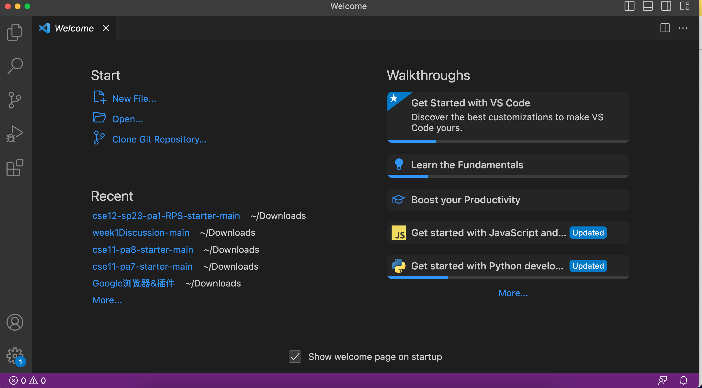
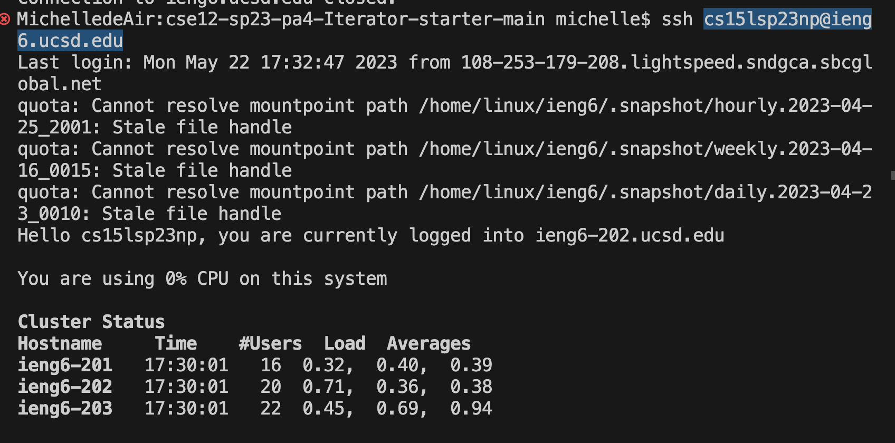
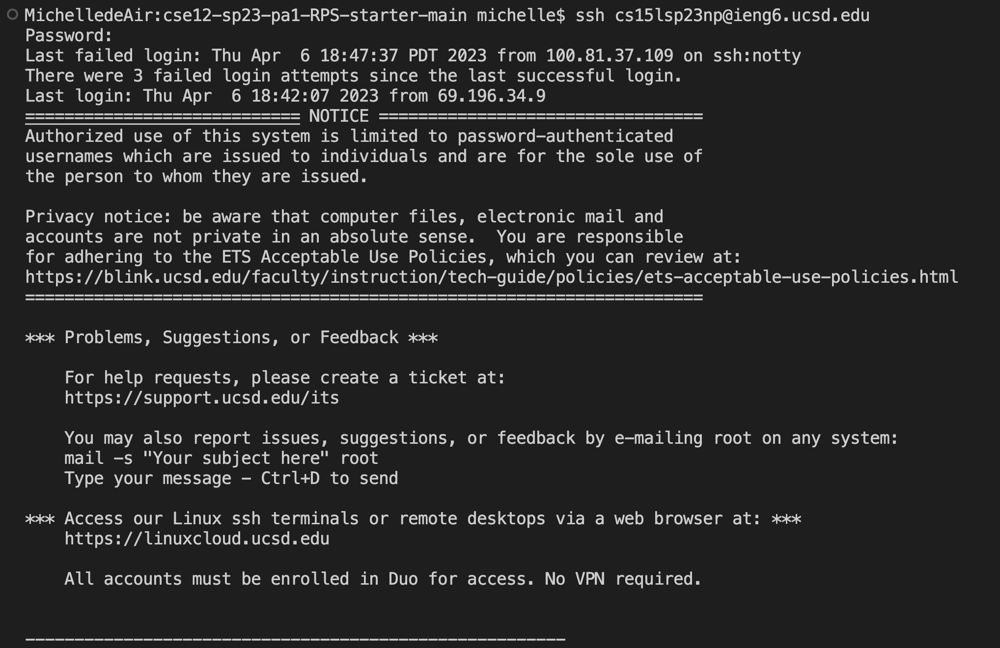
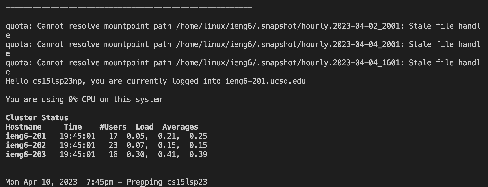
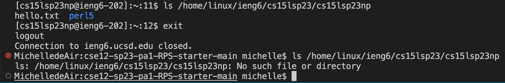

This is a tutorial for incoming 15L students. The following instruction includes logging into CSE15L account, setting up VScode, remotely connecting, and writing command.
## Log into course-specific account
1. open this link: [link](https://sdacs.ucsd.edu/~icc/index.php)
2. Type in the username you use for logging into your normal UCSD account and your student ID.
3. The word on the button under the "**Additional Account**" is your username. It starts with "**cs15lsp23**" and ends with two random characters. 

## Install Visual Studio Code
1. Use this [link](https://code.visualstudio.com/) to install and follow the instruction on this page.
(I didn't put the image of installation process since I have installed VScode on my computer a year ago. )
The following is a screenshot of an opened-VScode page. After your installation, the opened-VScode should be like this.

## Remotely connecting
1. Open the terminal, type in the following command after the bash: "ssh cs15lsp23zz@ieng6.ucsd.edu", replace the "zz" with the two characters in your own account. Then the terinal will ask for your password.
(If it is your first time for remote connection, your computer may have error message: 
"The authenticity of host 'ieng6.ucsd.edu (128.54.70.227)' can't be established.
RSA key fingerprint is SHA256:ksruYwhnYH+sySHnHAtLUHngrPEyZTDl/1x99wUQcec.
Are you sure you want to continue connecting (yes/no/[fingerprint])?"
Simply Type in yes. Since this is not my first time to conduct remoate connect, I did not show this here.)

2. Type in your password. Then the terminal will show the following thing:

This shows that our terminal is connected to a computer in CSE basement and the command we run on our own computer will at the same time run on that computer. Our computer is called client and the computer in the basement is called server. Then we will write some command

## Run some command

I typed in the command **ls /home/linux/ieng6/cs15lsp23/cs15lsp23np**. The username at the very end is my own username. When I type in my username after the directory, the computer lists files in my account(directory), which is perl5. 

When I exit the remote computer and type in the same command, the terminal shows “**No such file or directory**”. The directory I put in is the directory on the remote computer, which could not be found on our own computer; therefore, the directory does not exist on my own computer. 

