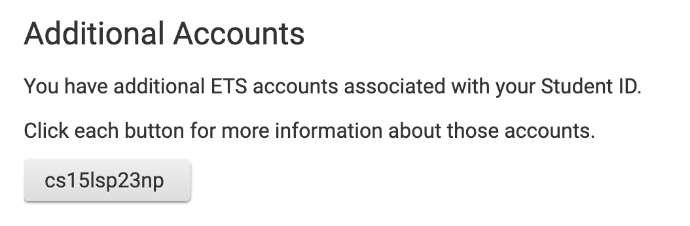
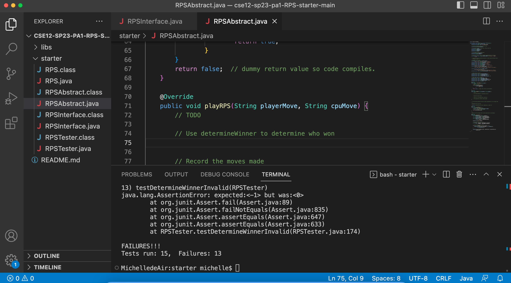

This is a tutorial for incoming 15L students. The following instruction includes logging into CSE15L account, setting up VScode, remotely connecting, and writing command.
## Log into course-specific account
1. open this link: [link](https://sdacs.ucsd.edu/~icc/index.php)
2. Type in the username you use for logging into your normal UCSD account and your student ID.
3. The word on the button under the "**Additional Account**" is your username. It starts with "**cs15lsp23**" and ends with two random characters. 

## Install Visual Studio Code
1. Use this [link](https://code.visualstudio.com/) to install and follow the instruction on this page.
The following is a screenshot of an opened-VScode page. After your installation, the opened-VScode should be like this.

## 
