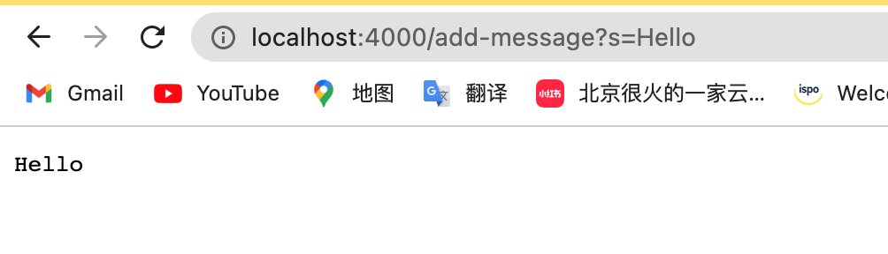
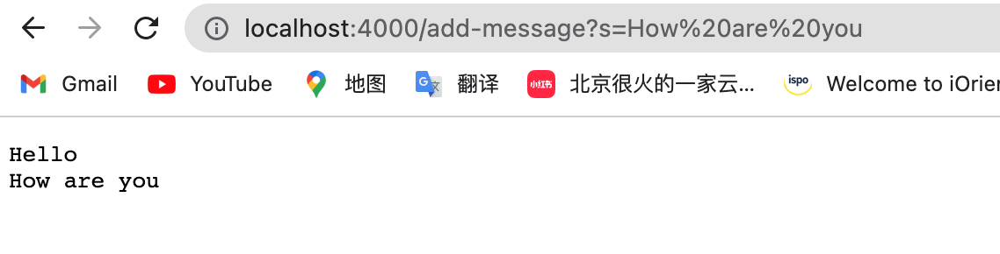
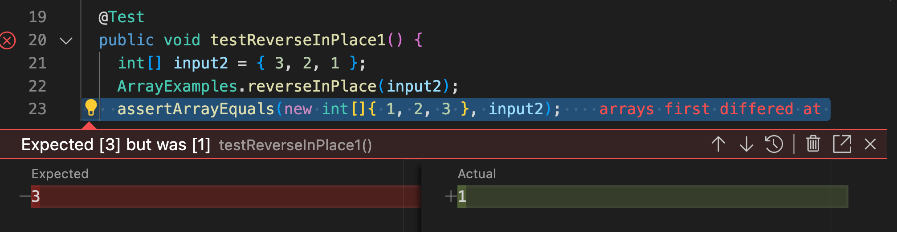
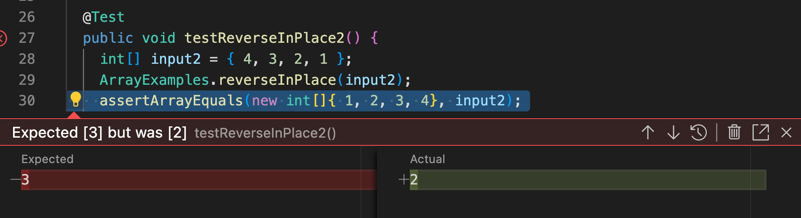

In this lab report I will write the stuff we learnt in the past two weeks, which will be divided into three parts. 
In part 1, I will write a web server called StringServer. 
In part 2, I will show the process of debugging. 
In part 3, I will summarize and reflection on the new things that I learnt in the past two weeks.

## PART1: Write a web-server
```
import java.io.IOException;
import java.net.URI;

class Handler implements URLHandler {
    // The one bit of state on the server: a number that will be manipulated by
    // various requests.
    String new_String = "";

    public String handleRequest(URI url) {
        System.out.println("Path: " + url.getPath());
        if (url.getPath().contains("/add-message")) {
            String[] parameters = url.getQuery().split("=");
            if (parameters[0].equals("s")) {
                new_String +=parameters[1]+"\n";
                return new_String;
            }
        }
        return "404 Not Found!";
        
    }
}

class StringServer {
    public static void main(String[] args) throws IOException {
        if(args.length == 0){
            System.out.println("Missing port number! Try any number between 1024 to 49151");
            return;
        }

        int port = Integer.parseInt(args[0]);

        Server.start(port, new Handler());
    }
}
```


The main method in the StringServer is first called, where we passed the port number and server is started. Then the handleRequest method in the class Handler is called, it takes in the URL `http://localhost:4000/add-message?s=Hello` and shows the string "hello" on the webpage. In this case, the argument we passed in is 4000 in a string for port number in main method. Also, another argument is URL `http://localhost:4000/add-message?s=Hello` we passed in for handleRequest method in Handler class.  The newString changed from empty string to `Hello`.


In this image, the main method in the StringServer is still called. Then the handleRequest method in the class Handler is called, it takes in the URL `http://localhost:4000/add-message?s=How are you` and shows the string `hello+\n+How are you` on the webpage. In this case, the argument we passed in is 4000 in a string for port number in main method. Also, another argument is URL `http://localhost:4000/add-message?s=How are you` we passed in for handleRequest method in Handler class.  The newString changed from empty string to `Hello`.


## Part2: Debug

```
@Test 
	public void testReverseInPlace() {
    int[] input1 = { 3 };
    ArrayExamples.reverseInPlace(input1);
    assertArrayEquals(new int[]{ 3 }, input1);
	}
```

{3} is the input that does not cause failure. 


```
@Test 
	public void testReverseInPlace1() {
    int[] input2 = { 3, 2, 1 };
    ArrayExamples.reverseInPlace(input2);
    assertArrayEquals(new int[]{ 1, 2, 3 }, input2);
	}
```
The failure-induced input here is {3, 2, 1}. From the Junit test failure, we could perceive that the actual output is {1, 2, 1} rather than {1, 2, 3}.

```
 @Test 
	public void testReverseInPlace2() {
    int[] input2 = { 4, 3, 2, 1 };
    ArrayExamples.reverseInPlace(input2);
    assertArrayEquals(new int[]{ 1, 2, 3, 4}, input2);
	}
```
The failure-induced input here is {4, 3, 2, 1}. From the Junit test failure, we could perceive that the actual output is {1, 2, 2, 1} rather than {1, 2, 3,4}.

The following is the symptom.



The code before looks like this:

```
public class ArrayExamples {
  // Changes the input array to be in reversed order
  static void reverseInPlace(int[] arr) {
    for(int i = 0; i < arr.length; i += 1) {
      arr[i] = arr[arr.length - i - 1];
    }
  }
```
  
For the original code, the loop is from zero to the length. I change it to zero to half of the length. Because when the iterator reaches the length of array, the last element in the array equals to the first element in the array. But the first element has been changed into 1 in the previous round of the iteration. 

I also add a temp variable to store the element of current index, and make the current element equals the last element. Make the last element to be equals to the temp. 

The code after is looks like this:
```
public class ArrayExamples {
  // Changes the input array to be in reversed order
  static void reverseInPlace(int[] arr) {
    for(int i = 0; i < arr.length/2; i += 1) {
      int temp=arr[i];
      arr[i] = arr[arr.length - i - 1];
      arr[arr.length - i - 1]=temp;
    }
  }
  ```


## Part 3: 
In week 2 and week 3, I learnt about how to write a webpage by myself using Java, which is pretty cool. For now we could adapt the 
I also learnt about the strategy to debug and how to use Junit. To save time for debugging, we could copy our code for testing. 


