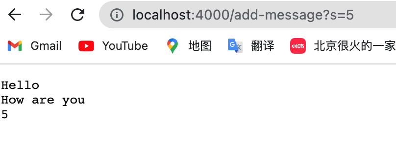

In this lab report I will write the stuff we learnt in the past two weeks, which will be divided into three parts. 
In part 1, I will write a web server called StringServer. 
In part 2, I will show the process of debugging. 
In part 3, I will summarize and reflection on the new things that I learnt in the past two weeks.

## PART1: Write a web-server

The main method in the StringServer is first called, where we passed the port number and server is started. Then the handleRequest method in the class Handler is called, it takes in the URL `http://localhost:4000/add-message?s=Hello` and shows the string "hello" on the webpage. In this case, the argument we passed in is 4000 in a string for port number in main method ad is url we passed in for handleRequest method in Handler class.  The newString changed from empty string to "Hello"

The main method in the StringServer is first called, where

