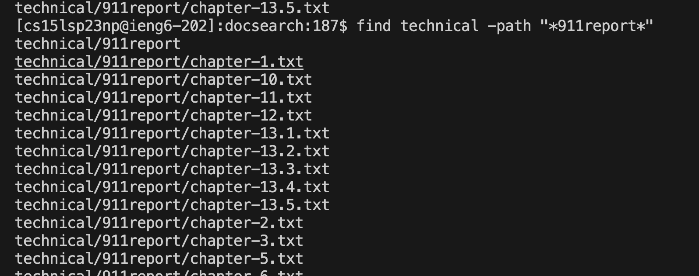

# Lab Report 3
In this lab, I will show 4 interesting commands regarding `find`. For each command, I will show two examples. 

## Command 1
In the first command, I will use `find` command with `-name`. In this way, we can find the files that matches with the name we want. 

### Example 1
For example, first of all, I want to find all the file that ends with `.txt`. I will input the command `find technical -name "*.txt"` so that the terminal would come up with all the txt file. 

### Example 2
The second example is when we input `find technical -name "chapter-1.txt"`. The command would help us to find all the find with name contains `chapter-1.txt`. 

Source:
`https://eng.libretexts.org/Bookshelves/Computer_Science/Operating_Systems/Linux_-_The_Penguin_Marches_On_(McClanahan)/05%3A_File_and_Directory_Management/2.05%3A_Searching_for_Files_on_Linux/2.05.01%3A_Searching_for_Files_on_Linux_-_find_Command`

## Command 2
The second command is use `find` with `-path`. This command would help us find all the find with path contains certain word. 
### Example 3
This example uses the command `find technical -path "*chapter-1*"`, which would print the path of all the file that its path contains `chapter-1`.

### Example 4
This example uses the command `find technical -path "*911report*"` to find all the file that its path contains the word "911report".

Source:
`https://eng.libretexts.org/Bookshelves/Computer_Science/Operating_Systems/Linux_-_The_Penguin_Marches_On_(McClanahan)/05%3A_File_and_Directory_Management/2.05%3A_Searching_for_Files_on_Linux/2.05.01%3A_Searching_for_Files_on_Linux_-_find_Command`

## Command 3
The third file is use `find` with `-type d`. This command is the same with the command `ls` but help us filter the results by file type.
### Example 5
This example uses the command `find technical -type d` to list all the file path and sorted according to the type of file.

### Example 6
This example uses the command `find government -type d` to list all the file path in government and sorted according to the type of file.

Source:
`https://www.redhat.com/sysadmin/linux-find-command`

## Command 4
The fourth file is use `find` with `-mtime`, which would find the file according to the age of file. 

### Example 7
This example uses the command `find -mtime -1` to list all the file path less than one day old. 

### Example 8
This example uses the command `find -mtime -1` to list all the file path more than one day old. As the file is just cloned today into the directory, it is very new so there is no file matches. 

Source:
`https://www.redhat.com/sysadmin/linux-find-command`

