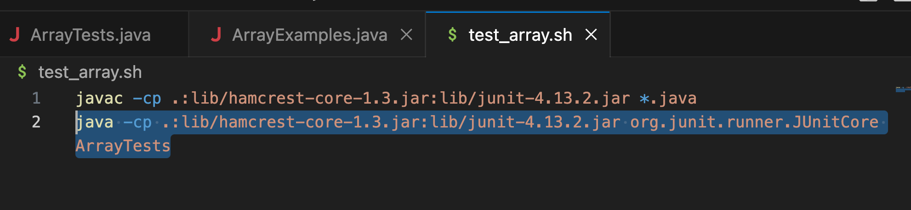
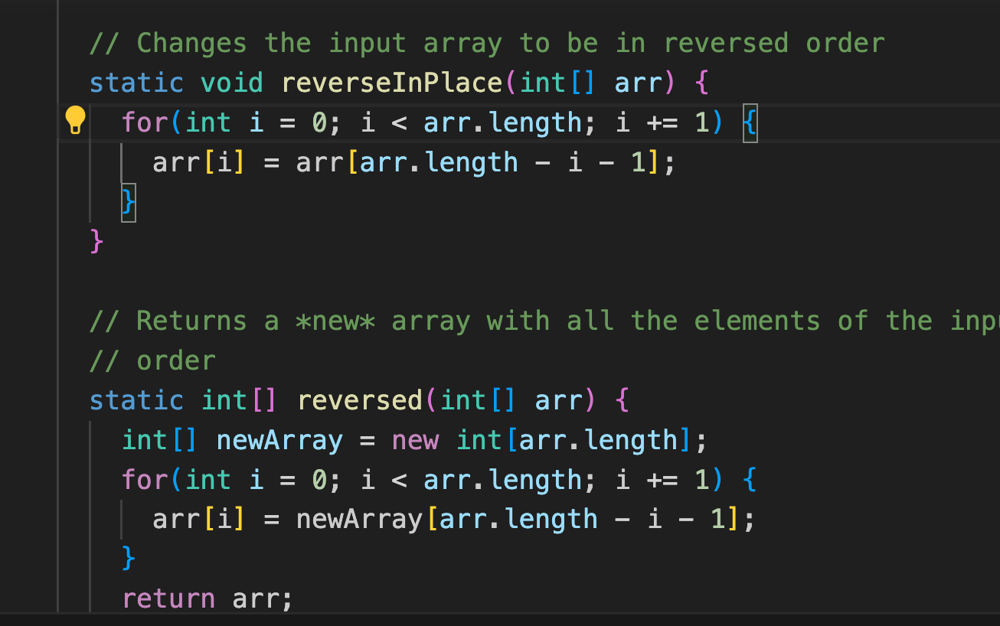
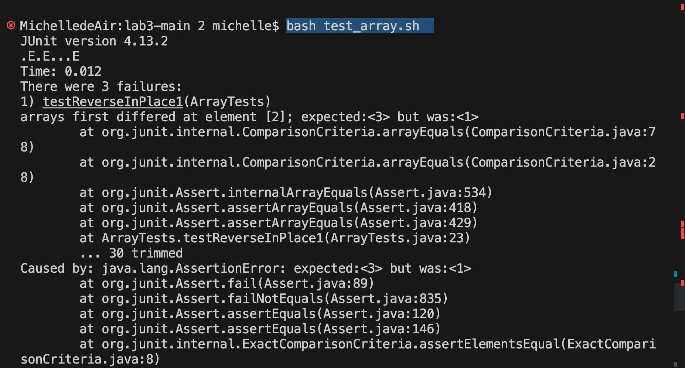
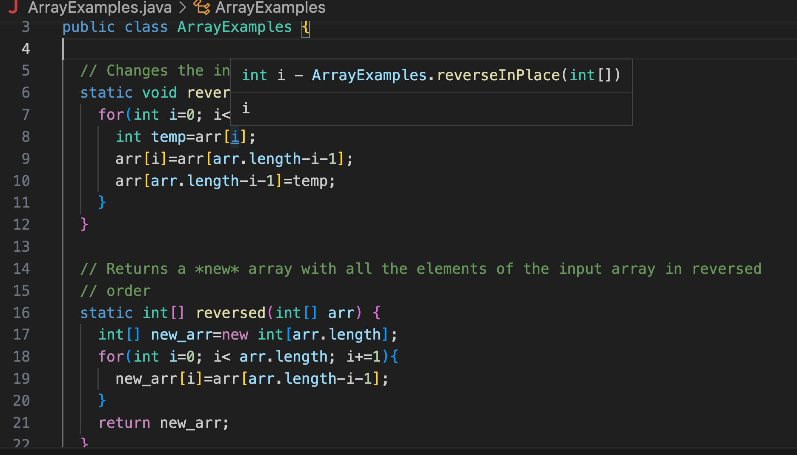
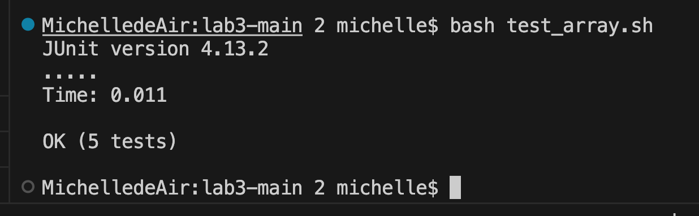

Student:
Hi there, I am using my own Mac computer with terminal in VS Code. 

I create a bash file called `test_array.sh`. 
Then I entered `javac -cp .:lib/hamcrest-core-1.3.jar:lib/junit-4.13.2.jar *.java`.
And then I entered `java -cp .:lib/hamcrest-core-1.3.jar:lib/junit-4.13.2.jar org.junit.runner.JUnitCore ArrayTests` in bash file.
I run the bash in terminal with command `bash test_array.sh`.


The test is expected to pass. However, the termimal shows index error. 
Here is my terminal and my code:



I don't know what I do wrong, could you please help me?

TA:
Hi, Here is what I thought may be helpful for you!
For the first one, the original code will reverse back after a reverse. So we have to make the loop only iterate to half of the length.
```
static void reverseInPlace(int[] arr) {
    for(int i=0; i< arr.length/2; i+=1){
      int temp=arr[i];
      arr[i]=arr[arr.length-i-1];
      arr[arr.length-i-1]=temp;
   }
 }
```


Student:
Thank you! I tried your suggestion!
First of all, I use vim to and convert it into insert mode, and then move the cursor to the line `for(int i=0; i< arr.length; i+=1)`.
And convert it into insert mode and type in `/2`. Then I insert in the bracket with `int temp=arr[i];` and `arr[arr.length-i-1]=temp;`


It works ! Thank you!

TA:
Great!


